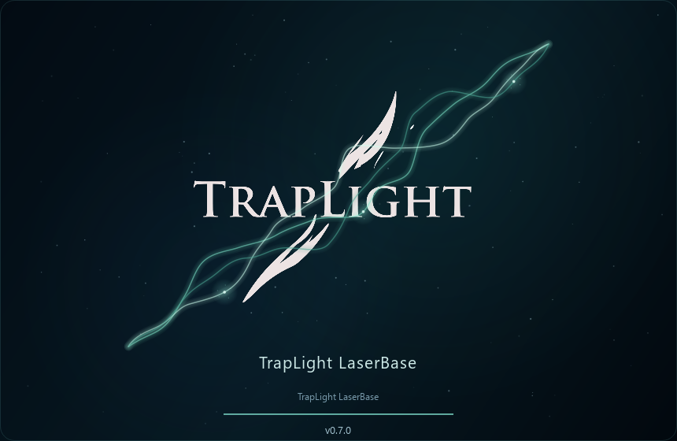

# TrapLight LaserBase

**Keep your laser experiments. Share useful settings. Build the library together.**

A Windows materials and settings library with photos, personal collections and direct peer-to-peer sharing. It works offline; connecting to another peer lets you exchange public records, photographs, ratings and feedback.

[**Download 0.7.5 — early test release**](https://github.com/Ashgsh/TrapLight-LaserBase/releases/tag/v0.7.5) · [Русский](README_RU.md) · [Report a problem](https://github.com/Ashgsh/TrapLight-LaserBase/issues/new/choose)

> **Early testing:** real testing between two separate computers is still needed. Please keep backups and report reproducible problems. This application records settings; it does not control a laser.

## Choose your download

| Download | Best for |
| --- | --- |
| [Setup.exe](https://github.com/Ashgsh/TrapLight-LaserBase/releases/download/v0.7.5/TrapLight_LaserBase_v0.7.5_SETUP.exe) | Installation for your Windows account, a Start menu shortcut and an optional desktop shortcut. No administrator access required by default. |
| [Portable.zip](https://github.com/Ashgsh/TrapLight-LaserBase/releases/download/v0.7.5/TrapLight_LaserBase_v0.7.5_PORTABLE.zip) | Extract into a writable folder and run `LaserBase.exe`. Keep the DLLs and subfolders together. |

Windows x64. Neither download includes a preset database of manufacturer-tested material settings. The shared library starts with experiments contributed by users. No account or subscription is required. The current builds are not digitally signed.

## What you can do

- Choose your device and module: **LaserPecker LX2, LP4 or LP5**, with capabilities described by device packs.
- Record materials, recipes and checks with **up to three optional photographs**.
- Use **My Lab** to create records; your own materials also appear in **My Library**.
- Browse received records in **Knowledge Base**, choose a 1–5 star rating, leave like/dislike and trial feedback, and save useful records to your library when you want.
- Export selected records and photographs to **Excel** or an **A4 print report**.
- Save or restore your full private library as a single **`.lbbackup`** file.
- Use English, Russian, Simplified Chinese, German, French or Spanish. Additional language files can be added locally.

One material ID groups signed revisions. Open its revision arrow to see separate ratings, spam reports and photographs. Your saved copy has its own local ID and never changes when the author edits the public material. Replacing it with another revision requires your confirmation; saved recipes remain unchanged. Peers running older versions can relay materials and revision feedback, but need v0.7.5 to display revision-specific feedback.

## Automatic peer-to-peer connection

Start LaserBase on each computer and accept the first-run rules. Discovery starts automatically through the public mainline DHT and the local network. Once peers authenticate, public signed materials, revisions, photographs, ratings and feedback synchronize. No TrapLight server or account is required. Choose **Network → Disconnect / work offline** to disable it persistently; manual IP connections remain under **Advanced**.

Allow LaserBase network access when Windows Firewall asks. IPv6 is supported, and compatible routers can open IPv4 ports through UPnP. Strict NAT, CGNAT and firewalls can still prevent direct connections: universal traversal is not implemented. Search covers received records. DHT-node counts are discovery contacts, not LaserBase users. Discovery advertises a network address; public traffic is signed but not encrypted. Private notes and identity keys remain local.

**Verified so far:** public DHT discovery with LAN discovery disabled, authenticated material/photo transfer, live revisions, protected personal snapshots and third-peer relay after the author disconnects. Test instances ran on one physical computer with public IPv6; independent internet connections and routers still need testing.

## Updates and backups

On the startup logo screen, LaserBase checks this official GitHub repository without blocking startup. If a newer complete Windows release is available, **Update** appears. Updating requires your confirmation, validates the archive's SHA-256 and saves a full backup to **Documents/TrapLight LaserBase Backups** before closing and restarting the application. The database, photos and Peer ID stay in place. Updating also works for an installed copy.

For a manual update, save a backup from **Export and print → Save base to one file** before replacing or deleting anything. Restore it with **Restore from file**, then reopen the program. Keep backups outside the application folder. They contain your private identity key; do not upload them to GitHub issues.

Setup updates and uninstalling preserve user-created library files. Reinstall in the same folder to reuse them. Manually deleting the folder removes its local library too. For interrupted program-file updates, the helper retains previous files under `.update/`; do not switch off the computer while files are being replaced.

## Help shape the first release

Two-computer LAN reports are particularly useful: tell us which device/module you selected, whether materials and all photos arrived, whether ratings appeared without reconnecting, and whether reconnecting after a network interruption worked. Please use the [issue templates](https://github.com/Ashgsh/TrapLight-LaserBase/issues/new/choose). A screenshot and exact reproduction steps help more than a general description.

Low scores and spam reports can place public records in a **30-day quarantine**. This is an early moderation system, not protection against coordinated fake identities. Keep settings appropriate to your actual machine and material, and follow the device manufacturer's operating precautions.

## Distribution and dependencies

This repository contains downloads, documentation and issue tracking. **LaserBase application source code is not published.** Qt 6.11.2 and MinGW dependency notices and license texts are included in the downloads. The release also provides the corresponding upstream Qt source archives separately; these are dependency sources, not LaserBase sources. See [third-party notices](THIRD_PARTY_NOTICES.md).

## Support TrapLight

If LaserBase helps you, you can [buy me a coffee — €3](https://paypal.me/ash4net/3EUR). Support is optional; the application works without donating.
