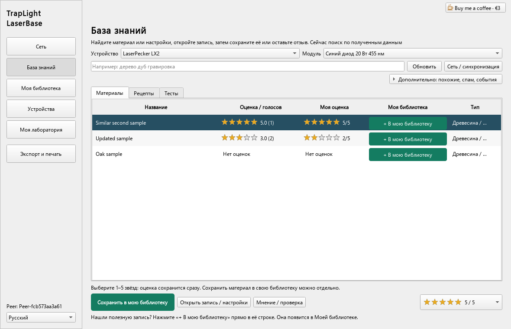
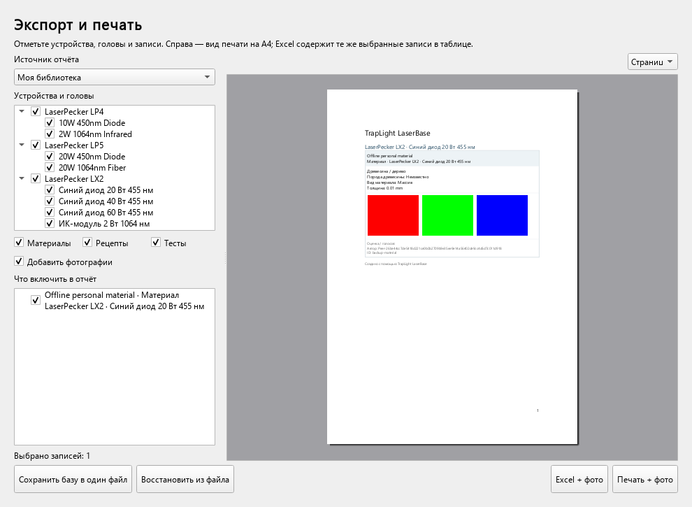

# TrapLight LaserBase

**Сохраняйте эксперименты с лазером. Делитесь полезными настройками. Наполняйте базу вместе.**

Локальная база материалов и настроек для Windows: фотографии, личная библиотека и обмен между подключёнными пользователями. Интернет не нужен для работы со своей базой. Программа хранит настройки, но не управляет лазером.

[**Скачать 0.7.2 — предварительную тестовую версию**](https://github.com/Ashgsh/TrapLight-LaserBase/releases/tag/v0.7.2) · [English](README.md) · [Сообщить об ошибке](https://github.com/Ashgsh/TrapLight-LaserBase/issues/new/choose)

> Нужна проверка между двумя настоящими компьютерами. Это первый публичный тестовый выпуск, а не завершённая версия. Сохраняйте резервные копии и сообщайте о воспроизводимых проблемах.

## Что скачать

| Вариант | Как пользоваться |
| --- | --- |
| [Setup.exe](https://github.com/Ashgsh/TrapLight-LaserBase/releases/download/v0.7.2/TrapLight_LaserBase_v0.7.2_SETUP.exe) | Обычная установка для текущего пользователя, ярлык в меню «Пуск», по желанию — на рабочем столе. По умолчанию права администратора не нужны. |
| [Portable.zip](https://github.com/Ashgsh/TrapLight-LaserBase/releases/download/v0.7.2/TrapLight_LaserBase_v0.7.2_PORTABLE.zip) | Распакуйте в папку с правом записи и запустите `LaserBase.exe`. Не отделяйте программу от DLL и вложенных папок. |

Windows x64. Сборки пока без цифровой подписи. Готовую базу настроек, проверенных изготовителем, не обещаем: материалы и результаты добавляют сами пользователи. Регистрация и подписка не нужны.

## Возможности

- Выбор **LaserPecker LX2, LP4 или LP5**, затем нужного модуля. Возможности устройства описываются его пакетом.
- Материалы, рецепты и проверки с **тремя необязательными фотографиями**.
- Свой материал из **«Моей лаборатории»** появляется и в **«Моей библиотеке»**.
- Чужие записи находятся в **«Базе знаний»**. Сохранение в личную библиотеку — по желанию.
- Оценка **1–5 звёзд**, лайк/дизлайк и результат проверки. Проверка привязана к исходной записи.
- **Excel и печать A4 с фотографиями**, выбор устройств, модулей и записей.
- Полная резервная копия одним файлом **`.lbbackup`**.
- Английский, русский, упрощённый китайский, немецкий, французский и испанский. Свои переводы можно добавить файлами.

## Соединить два компьютера

1. Запустите отдельную установку на каждом компьютере. **Peer ID должны отличаться**: не копируйте готовый ключ личности, чтобы создать второго пользователя.
2. На компьютере B откройте **Network / «Сеть»** и включите **Listen / «Слушать»** на доступном для A адресе. `127.0.0.1` работает только внутри одного компьютера; для локальной сети нужен сетевой адрес B.
3. На A выберите **Connect / «Подключиться»**, укажите локальный IP компьютера B и порт слушателя, обычно **45454**.
4. При запросе разрешите соединение в брандмауэре Windows для своей частной сети. Пока соединение активно, передаются публичные записи, фотографии и оценки. Если слушатель запущен позже, подключение повторяется автоматически.
5. Откройте **«Базу знаний»**, выберите подходящие устройство и модуль. Полезную чужую запись можно сохранить у себя.

Адрес вводится вручную. Автоматического поиска пользователей, соединения через NAT и поиска по всей P2P-сети пока нет. Поиск охватывает записи, уже полученные этой установкой. Публичные поля эксперимента и фотографии передаются подключённым пользователям; личные заметки остаются локально.

## Update и сохранность базы

При запуске на заставке программа проверяет версии в официальном репозитории GitHub. Проверка не задерживает работу без интернета. Если есть более новый полный выпуск, появляется **Update**. После подтверждения проверяется SHA-256 архива и создаётся полная резервная копия в **«Документы/TrapLight LaserBase Backups»**. Затем программа закрывается, обновляет свои файлы и запускается снова. База, фотографии и Peer ID остаются на месте. Это работает и после установки через Setup.

Перед ручным обновлением или удалением папки используйте **«Экспорт / печать» → «Сохранить базу в один файл»**. Храните файл вне папки программы. Для восстановления выберите **«Восстановить из файла»**, подтвердите замену и запустите программу снова. Резервная копия содержит ваш приватный ключ Peer ID — не прикладывайте её к публичным сообщениям об ошибках.

Обновление установщиком и его удаление сохраняют созданные вами файлы базы. Переустановка в ту же папку позволяет продолжить работу с ними. Ручное удаление всей папки удаляет и локальную базу. Прежние заменённые файлы при Update сохраняются в `.update/`; не выключайте питание во время замены файлов.

## Помогите проверить

Особенно нужны отчёты с двух компьютеров: пришли ли материал и все фотографии, появилась ли оценка без переподключения, восстановился ли обмен после обрыва связи. В [сообщении об ошибке](https://github.com/Ashgsh/TrapLight-LaserBase/issues/new/choose) укажите устройство, модуль, версию и шаги повторения. Можно писать по-русски.

Сильный перевес низких оценок и жалобы на спам могут отправить публичную запись в карантин на **30 дней**. Это начальная система модерации; она не гарантирует защиту от сговора фиктивных пользователей. Проверяйте применимость настроек к своей машине и материалу, соблюдайте инструкции изготовителя лазера.

## Исходники и библиотеки

Исходники **LaserBase не публикуются**. Здесь размещаются готовые выпуски, инструкции и сообщения об ошибках. В поставку включены лицензии Qt 6.11.2 и MinGW. Отдельные архивы исходников Qt нужны для лицензий сторонних библиотек и не содержат исходников LaserBase. Подробнее: [лицензии библиотек](THIRD_PARTY_NOTICES.md).

Если программа полезна, можно [угостить автора кофе — €3](https://paypal.me/ash4net/3EUR). Это добровольно, все функции доступны без доната.
